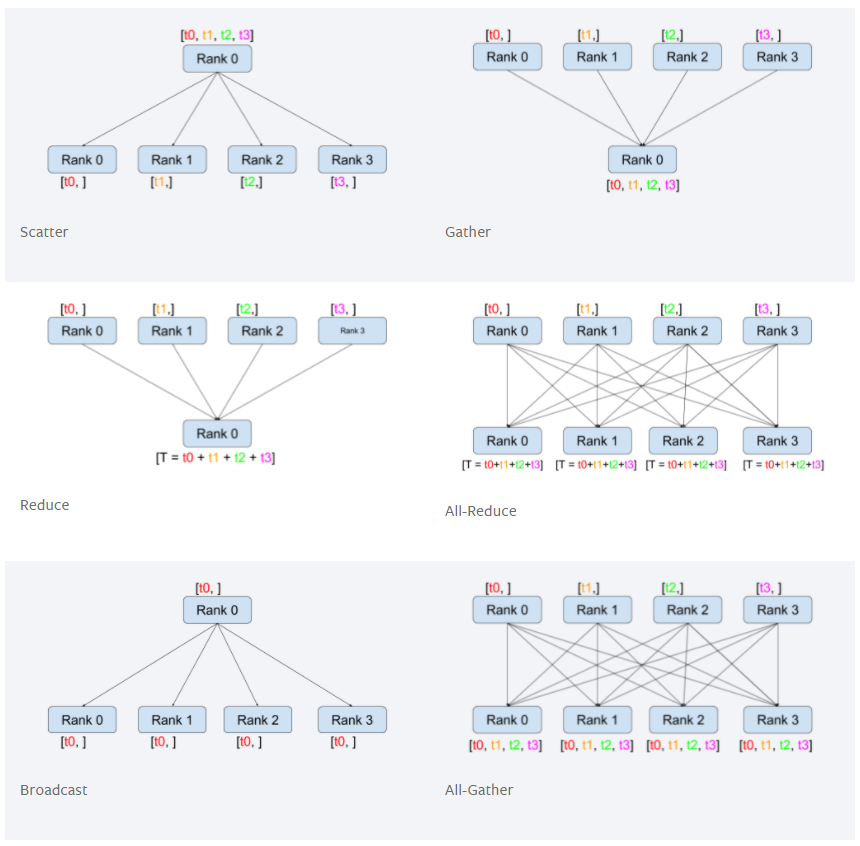

# Pytorch-MultiGPU
  
본 글에서는 Pytorch 에서 제공하는 Distribute 모듈을 이용한 병렬 GPU 연산을 수행합니다.

## Pytorch Distribute  
Pytorch 에서 제공하는 Distribute 모듈은 병렬 GPU 연산을 수행할 수 있도록 합니다.  
정확하게 말하면 멀티 프로세스를 이용하여 각 프로세스당 다른 GPU를 할당받아 학습을 한 후 학습 결과를 수집하여 평균을 계산 후 각 프로세스의 모델을 갱신하는 방식으로 병렬 연산을 수행합니다.  

## 사용 방법
기본적으로 해당 코드는 GPU 연산을 기반으로 수행하며 GPU 개수가 최소 2개 이상인 경우를 가정합니다. (1개일 때도 코드 수행은 됩니다.)  

1. Pytorch Distribute 사용을 위한 모듈 가져오기
```python
import torch.distributed as dist
import torch.multiprocessing as mp
from random import Random
```
  
2. 데이터 셋을 분할하기 위한 DataPartitionor 클래스 정의    
```python
class DataPartitioner(object):
    """ 데이터 셋 분할 클래스 """
    def __init__(self, data, sizes=[0.7, 0.2, 0.1], seed=1234):
        self.data = data
        self.partitions = []
        rng = Random()
        rng.seed(seed)
        data_len = len(data)
        indexes = [x for x in range(0, data_len)]
        rng.shuffle(indexes)

        for frac in sizes:
            part_len = int(frac * data_len)
            self.partitions.append(indexes[0:part_len])
            indexes = indexes[part_len:]

    def use(self, partition):
        return self.partitions[partition]
```  
- 데이터의 길이를 이용하여 Size에 맞게 랜덤한 인덱스를 배포하고 리스트로 저장한다.  
- use 메소드를 호출하면 해당 인덱스에 맞는 데이터 인덱스들을 반환한다.  

3. 사용할 GPU 리스트를 및 개수를 저장한다.  
```python
# 사용할 GPU PCI 번호 리스트로 작성
self.gpu_ids = [2, 3]

# GPU 개수 등의 정보 저장
size = len(self.gpu_ids)
```

4. Train 데이터 리스트를 변수에 저장하고 DataPartitioner 객체를 생성한다.  
```python
# 전체 Train 데이터 리스트를 변수에 저장
self.train_dataset = [os.path.join(self.opt.train_file, x) for x in os.listdir(self.opt.train_file) if check_image_file(x)]

# 데이터 셋 설정
partition_sizes = [1.0 / size for _ in range(size)]
self.partition = DataPartitioner(self.train_dataset, partition_sizes)
```

5. 프로세스를 생성하고 실행 시킨다.  
```python
# 프로세스 시작
for rank in range(size):
    p = mp.Process(target=self.init_process, args=(rank, size))
    p.start()
    processes.append(p)            

# 프로세스가 절차를 완료하거나 오류가 발생하면 안전하게 종료
for p in processes:
    p.join()
```

6. 프로세스 Train 시작하기 이전 환경 설정  
```python
def init_process(self, rank, size, backend="gloo"):
    """ 분산 학습을 위한 프로세스 생성 함수 """
    # 분산 학습을 진행하는 IP 주소, 포트번호 설정
    os.environ["MASTER_ADDR"] = "127.0.0.1"
    os.environ["MASTER_PORT"] = "29500"

    # Model Loss 공유를 위하여 그룹 생성
    dist.init_process_group(backend, rank=rank, world_size=size)

    # 학습 프로세스 실행
    self.run(rank, size)
```

7. Train 진행 중 Loss 역전파 완료 후 각 프로세스간 파라미터 공유
```python
# Discriminator Loss 업데이트
scaler.scale(d_loss).backward()
average_gradients(discriminator)
scaler.step(discriminator_optimizer)
scaler.update()
```

8. 프로세스 간 파라미터 공유 함수
```python
def average_gradients(model):
    """ 변화도 평균 계산하기 """
    size = float(dist.get_world_size())
    for param in model.parameters():
        dist.all_reduce(param.grad.data, op=dist.ReduceOp.SUM)
        param.grad.data /= size
```